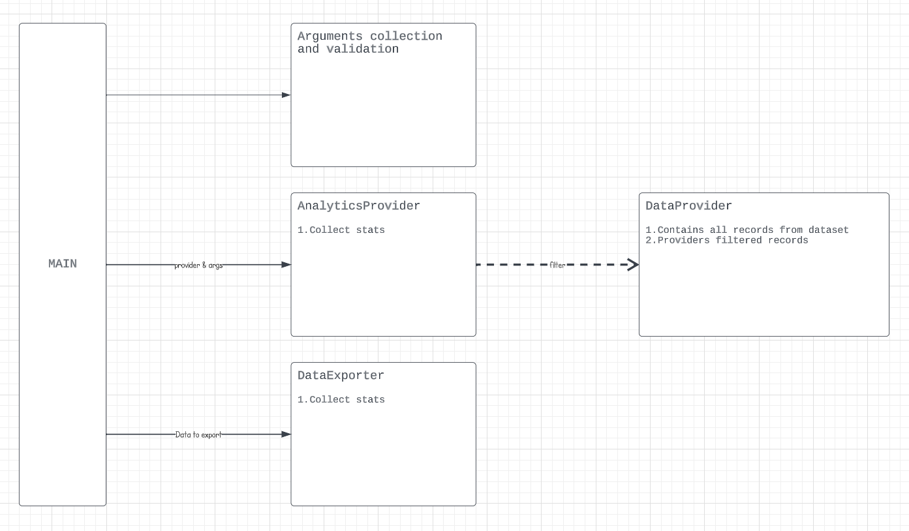

# Дата: 24/11/2023

## Основні теми, що були розглянуті:
- **Assignment 6:**
  - Робота з аргументами командного рядка за допомогою `argparse`
  - Структурування 6 роботи
  - Завантаження і опрацювання даних
    - Фільтрація заснована на предикатах

## Assignment 6

### Робота з аргументами командного рядка за допомогою `argparse`.

```python
import argparse
parser = argparse.ArgumentParser() # Створення парсере

# Додавання аргументу, у якого є 2 підагрументи
parser.add_argument( 
  '-medals',
  nargs=2,
  metavar=("country", "year")
)

# Парсинг агрументів
args = parser.parse_args()
print(args)
```

### Структурування 6 роботи


### Завантаження і опрацювання даних
```python
import csv
class OlympicsDataProvider:
    __records: set[Item]

    def __init__(self, path: str):
        self.__records = self.__get_data(path)

    def get_applicable_records(self, predicate=lambda x: True) -> set[Item]:
        return set(filter(predicate, self.__records))

    @staticmethod
    def __get_data(path: str) -> set[Item]:

        MEDALS_INDEX = 14

        records = set()
        with open(path, 'r') as file:
            reader = csv.reader(file, delimiter="\t")
            for line in reader:

                if line[MEDALS_INDEX] == "NA":
                    continue

                records.add(Item(line))

        return records
```

### Фільтрація заснована на предикатах
```python
data = ["hello", "world"]

predicate = lambda s: s == "hello"
filtered = list(filter(predicate, data))

print(filtered)
```

